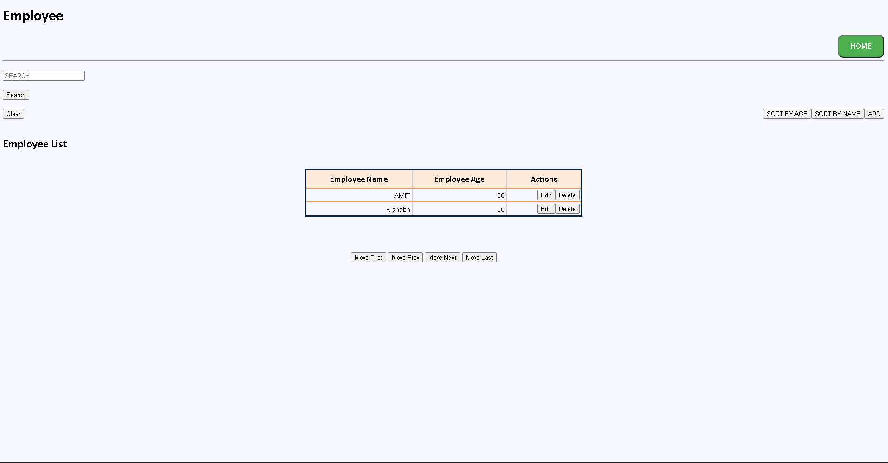

# Implementation of Searching,Sorting and Pagination
This is the link to the assignment number 1 given by Traklabs to learn javaScript and HTML
just open navbar.html as it is the first page of this project from there on use the navigation bar to navigate to your favorite part of the website
navbar helps you to navigate to Employee or Department pages

Once you nagivate to the Employee or the Department page you get to see the employee list

Here you can see you have lots of features to play around with I WILL TAKE YOU ON A TOUR ONE BY ONE
1. SEARCHING :- with this you are able to search every employee who is in the database by just typing in his/her name
2. SORTING :- There are bascially two types of sort here one is by age and other is by the employee name both have been given different buttons
3. Pagination :- as you can see you can move around the table using the below navigator (movefirst,movePrev,moveNext,moveLast)
4. ADD/EDIT/DELETE  :- ALL THESE FEATURES ARE THERE AND ARE VERY EASY TO BE USED IF YOU MAKE A MISTAKE YOU CAN ALWAYS USE THESE FUNCTIONS TO UNDO 

ALSO there, A HOME BUTTON IF YOU GET LOST JUST CLICK ON IT AND BOOM you are back to the navbar page our homepage . 
